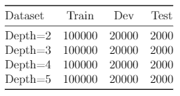
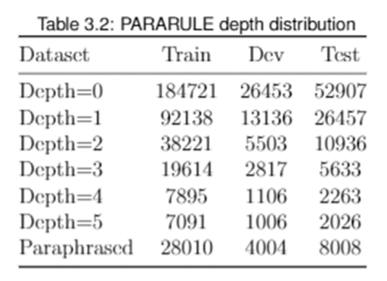
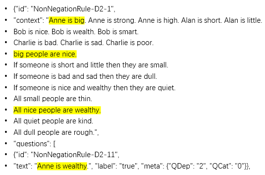
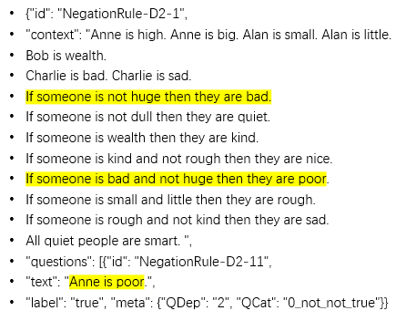
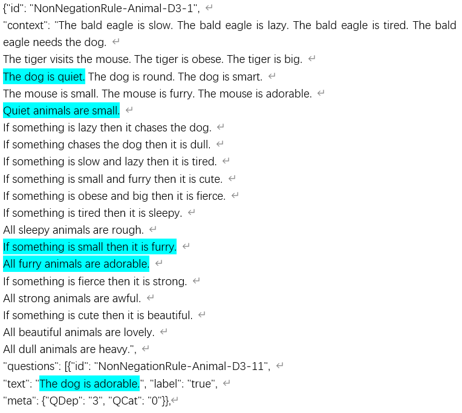
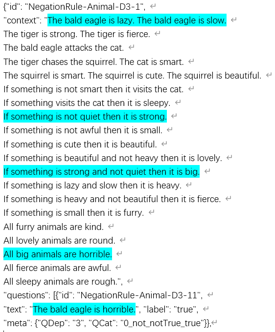
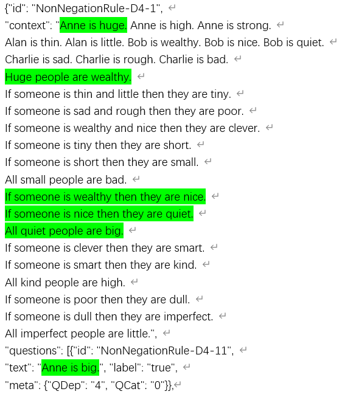
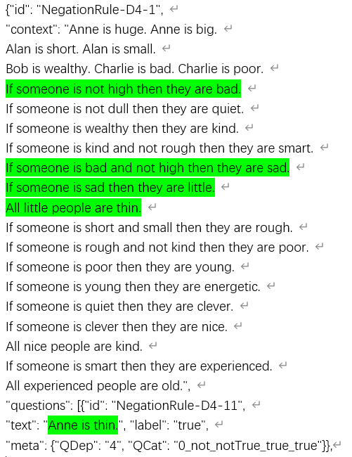
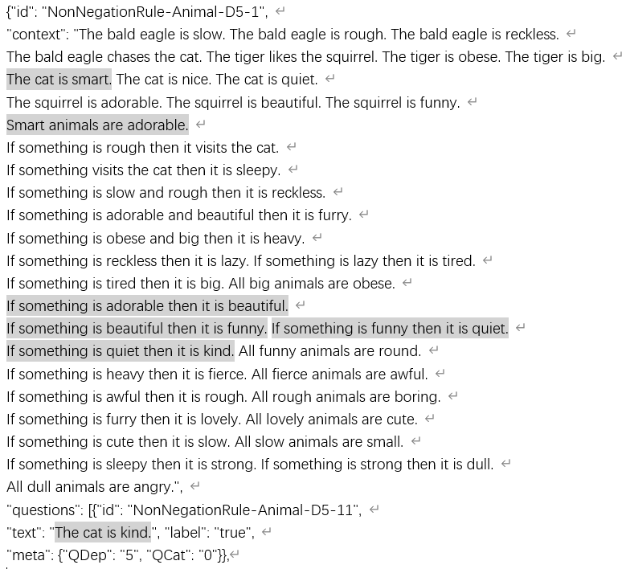
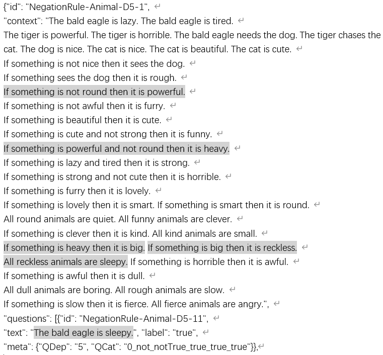

# PARARULE Plus
The new generated dataset for PARARULE. It is generated based on the closed-world assumption.
PARARULE Plus is a deep multi-step reasoning dataset over natural language. It can be seen as an improvement on the dataset of PARARULE (Peter Clark et al., 2020). The motivation is to generate deeper PARARULE training samples. We add more training samples for the case where the depth is greater than or equal to two to explore whether Transformer has reasoning ability. PARARULE Plus is a combination of two types of entities, `animals` and `people`, and corresponding relationships and attributes. From the depth of 2 to the depth of 5, we have 100,000 samples in the depth of each layer, and there are a total of 400,000 samples.
## Animals
`Animal Entities` ['the bald eagle', 'the tiger', 'the bear', 'the lion', 'the wolf', 'the crocodile', 'the dinosaur', 'the snake', 'the leopard']

`Animal Entities-2` ['the cat', 'the dog', 'the mouse', 'the rabbit', 'the squirrel']

`Animal Relationship` ['is', 'likes', 'chases', 'needs', 'visits', 'attacks', 'sees']

`Animal Attributes-1` ['kind', 'quiet', 'round', 'nice', 'smart', 'clever']

`Animal Attributes-2` ['dull', 'rough', 'lazy', 'slow', 'sleepy', 'boring', 'tired', 'reckless']

`Animal Attributes-3` ['furry', 'small', 'cute', 'lovely', 'beautiful', 'funny']

`Animal Attributes-4` = ['big', 'strong', 'awful', 'fierce', 'heavy', 'horrible', 'powerful', 'angry']

|The Num of Animal Entities|The Num of Animal Relationships|The Num of Animal Attributes|
|:----:|:----:|:----:|
|14|7|28|

## People
`People Entities` ['Anne', 'Alan', 'Bob', 'Charlie', 'Dave', 'Erin', 'Harry', 'Gary', 'Fiona']

`People Relationship` ['is']

`People Attributes-1` ['big', 'strong', 'high', 'huge']

`People Attributes-2` ['short', 'thin', 'small', 'little', 'tiny']

`People Attributes-3` ['wealthy', 'smart', 'nice', 'quiet', 'kind', 'clever']

`People Attributes-4` = ['poor', 'dull', 'rough', 'bad', 'sad']


|The Num of People Entities|The Num of People Relationships|The Num of People Attributes|
|:----:|:----:|:----:|
|9|1|20|


## PARARULE Plus Data distribution
For each depth dataset, we have more than 100,000 datasets to be used, much larger than the same depth in PARARULE.
### PARARULE Plus

|Dataset|Train|Dev|Test|
|:---|:----:|:----:|:----:|
|Depth=2|100000|20000|2000|
|Depth=3|100000|20000|2000|
|Depth=4|100000|20000|2000|
|Depth=5|100000|20000|2000|

<!---->
### PARARULE

|Dataset|Train|Dev|Test|
|:---|:----:|:----:|:----:|
|Depth=0|184721|26453|52907|
|Depth=1|92138|13136|26457|
|Depth=2|38221|5503|10936|
|Depth=3|19614|2817|5633|
|Depth=4|7895|1106|2263|
|Depth=5|7091|1006|2026|
|Paraphrased|28010|4004|8008|

<!--<div align=center></div>-->

## Examples
### An example with the non-negation rules for Depth=2 means the question needed to be derived by two rules.

The `QCat=0` means the question is generated from non-negation rules and the label is `true`. If the `QCat=0_0`, it means the question is generated from non-negation rules and the label is `false`.

### An example with the negation rules for Depth=2 means the question needed to be derived by two rules.


### An example with the non-negation rules for Depth=3 means the question needed to be derived by three rules.


### An example with the negation rules for Depth=3 means the question needed to be derived by three rules.


### An example with the non-negation rules for Depth=4 means the question needed to be derived by four rules.


### An example with the negation rules for Depth=4 means the question needed to be derived by four rules.


### An example with the non-negation rules for Depth=5 means the question needed to be derived by five rules.


### An example with the negation rules for Depth=5 means the question needed to be derived by five rules.


#### Depth=2
The `QCat=0_not_notTrue` means the question is generated from one negation rule and another negation rule `and` a positive rule and the label is `true`. 
The `QCat=0_0_not_notTrue` means the question is generated from one negation rule and another negation rule `and` a positive rule and the label is `false`. 
The `QCat=0_true_trueNot` means the question is generated from one positive rule and another positive rule `and` a negation rule and the label is `true`. 
The `QCat=0_0_true_trueNot` means the question is generated from one positive rule and another positive rule `and` a negation rule and the label is `false`. 

#### Depth=3
The `QCat=0_not_notTrue_true` means the question is generated from one negation rule and another negation rule `and` a positive rule and a positive rule and the label is `true`. 
The `QCat=0_0_not_notTrue_true` means the question is generated from one negation rule and another negation rule `and` a positive rule and a positive rule and the label is `false`. 
The `QCat=0_true_trueNot_true` means the question is generated from one positive rule and another positive rule `and` a negation rule and and a positive rule and the label is `true`. 
The `QCat=0_0_true_trueNot_true` means the question is generated from one positive rule and another positive rule `and` a negation rule and a positive rule and the label is `false`. 

#### Depth=4
The `QCat=0_not_notTrue_true_true` means the question is generated from one negation rule and another negation rule `and` a positive rule and two more positive rules and the label is `true`. 
The `QCat=0_0_not_notTrue_true_true` means the question is generated from one negation rule and another negation rule `and` a positive rule and two more positive rules and the label is `false`. 
The `QCat=0_true_trueNot_true_true` means the question is generated from one positive rule and another positive rule `and` a negation rule and two more positive rules and the label is `true`. 
The `QCat=0_0_true_trueNot_true_true` means the question is generated from one positive rule and another positive rule `and` a negation rule and two more positive rules and the label is `false`. 

#### Depth=5
The `QCat=0_not_notTrue_true_true_true` means the question is generated from one negation rule and another negation rule `and` a positive rule and three more positive rules and the label is `true`. 
The `QCat=0_0_not_notTrue_true_true_true` means the question is generated from one negation rule and another negation rule `and` a positive rule and three more positive rules and the label is `false`. 
The `QCat=0_true_trueNot_true_true_true` means the question is generated from one positive rule and another positive rule `and` a negation rule and three more positive rules and the label is `true`. 
The `QCat=0_0_true_trueNot_true_true_true` means the question is generated from one positive rule and another positive rule `and` a negation rule and three more positive rules and the label is `false`. 

## Detail for the data generation scripts
### Scripts
#### Depth=2
 - `new_data_generation_NegationRule-D2.py` - The question needed to be derived by two rules, part of them are the negation rules.
 - `new_data_generation_NegationRule-animal-D2.py` - The question with animal entities needed to be derived by two rules includes the negation rules.
 - `new_data_generation_NonNegationRule-D2.py` - The question needed to be derived by two rules, all of them are the non-negation rules.
 - `new_data_generation_NonNegationRule-animal-D2.py` - The question with animal entities needed to be derived by two rules includes the non-negation rules.
#### Depth=3
 - `new_data_generation_NegationRule-D3.py` - The question needed to be derived by three rules, part of them are the negation rules.
 - `new_data_generation_NegationRule-animal-D3.py` - The question with animal entities needed to be derived by three rules includes the negation rules.
 - `new_data_generation_NonNegationRule-D3.py` - The question needed to be derived by three rules, all of them are the non-negation rules.
 - `new_data_generation_NonNegationRule-animal-D3.py` - The question with animal entities needed to be derived by three rules includes the non-negation rules.
#### Depth=4
 - `new_data_generation_NegationRule-D4.py` - The question needed to be derived by four rules, part of them are the negation rules.
 - `new_data_generation_NegationRule-animal-D4.py` - The question with animal entities needed to be derived by four rules includes the negation rules.
 - `new_data_generation_NonNegationRule-D4.py` - The question needed to be derived by four rules, all of them are the non-negation rules.
 - `new_data_generation_NonNegationRule-animal-D4.py` - The question with animal entities needed to be derived by four rules includes the non-negation rules.
#### Depth=5
 - `new_data_generation_NegationRule-D5.py` - The question needed to be derived by five rules, part of them are the negation rules.
 - `new_data_generation_NegationRule-animal-D5.py` - The question with animal entities needed to be derived by five rules includes the negation rules.
 - `new_data_generation_NonNegationRule-D5.py` - The question needed to be derived by five rules, all of them are the non-negation rules.
 - `new_data_generation_NonNegationRule-animal-D5.py` - The question with animal entities needed to be derived by five rules includes the non-negation rules.
 
 `shuffle_data.py` - The generated data is shuffled by this scripts.

## Citation
```
@unpublished{
  title={PARARULE Plus: A Larger Deep Multi-Step Reasoning Dataset over Natural Language},
  author={Qiming Bao},
  year={2021}
}
```

## Other links
The PARARULE dataset is from that paper.
 [Transformers as Soft Reasoners over Language](https://arxiv.org/abs/2002.05867). 

The online demo for PARARULE.
https://rule-reasoning.apps.allenai.org/

PARARULE dataset
https://allenai.org/data/ruletaker

Explaining Answers with Entailment Trees
https://arxiv.org/pdf/2104.08661.pdf

ProofWriter: Generating Implications, Proofs, and Abductive Statements over Natural Language
https://arxiv.org/pdf/2012.13048.pdf

PRover: Proof Generation for Interpretable Reasoning over Rules
https://arxiv.org/abs/2010.02830

Neural Unification for Logic Reasoning over Natural Language
https://www.researchgate.net/profile/Gabriele-Picco-2/publication/354653211_Neural_Unif[…]-Unification-for-Logic-Reasoning-over-Natural-Language.pdf

Measuring Systematic Generalization in Neural Proof Generation with Transformers
https://arxiv.org/pdf/2009.14786.pdf

Investigating the Limitations of the Transformers with Simple Arithmetic Tasks
http://arxiv.org/abs/2102.13019v1

NATURALPROOFS: Mathematical Theorem Proving in Natural Language
https://arxiv.org/pdf/2104.01112.pdf

Graph-to-Tree Learning for Solving Math Word Problems
https://www.aclweb.org/anthology/2020.acl-main.362.pdf

Natural Language Premise Selection: Finding Supporting Statements for Mathematical Text
https://arxiv.org/pdf/2004.14959.pdf

Learning To Prove From Synthetic Theorems
https://arxiv.org/pdf/2006.11259.pdf

Are Pretrained Language Models Symbolic Reasoners Over Knowledge?
https://arxiv.org/pdf/2006.10413.pdf

Facts as Experts: Adaptable and Interpretable Neural Memory over Symbolic Knowledge
https://arxiv.org/pdf/2007.00849.pdf

Compressive Transformers for Long-Range Sequence Modelling
https://arxiv.org/abs/1911.05507

HOTPOTQA: A Dataset for Diverse, Explainable Multi-hop Question Answering
https://www.aclweb.org/anthology/D18-1259.pdf

Applying the Closed World Assumption to SUMO-based FOL Ontologies for Effective Commonsense Reasoning
http://ecai2020.eu/papers/1076_paper.pdf

Teaching Pre-Trained Models to Systematically Reason Over Implicit Knowledge
https://arxiv.org/pdf/2006.06609.pdf
