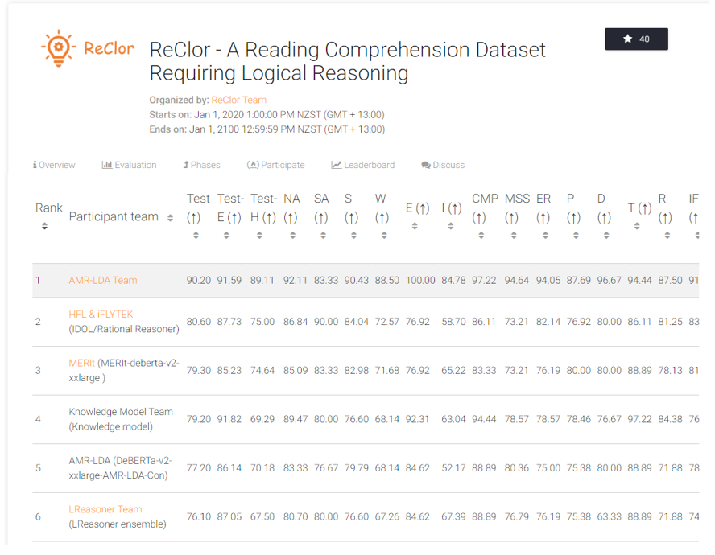

# Logical-Equivalence-driven-AMR-Data-Augmentation-for-Representation-Learning

We proposed a new AMR-based logic-driven data augmentation for contrastive learning intermediate training and then we conduct the downstream tasks require logical reasoning including logical reasoning reading comprehension tasks (ReClor and LogiQA) and natural language inference tasks (MNLI, MRPC, RTE, QNLI and QQP). Our `AMR-LDA` model (AMR-LDA Prompt Augmentation+GPT4) and `AMR-LDA (DeBERTa-v2-xxlarge-AMR-LDA-Cont)` lead the [ReClor leaderboard](https://eval.ai/web/challenges/challenge-page/503/leaderboard/1347) and we are the first group scored above 90% on the hidden test set around the world. Our [paper](https://aclanthology.org/2024.findings-acl.353/) has been accepted by the Findings of ACL-24.
<!-- and we also release the model weights on `Huggingface/models`.-->



<!--
## 🤗 Model weights
We released model weights that have been trained on our AMR-LDA augmented data. It is welcome to load them and train them on the downstream tasks that require logical reasoning and natural language inference tasks. Please note that AMR-LE was the old name for our model. We rename our model's name as AMR-LDA. The model weight does not change.

[AMR-LE-DeBERTa-V2-XXLarge-Contraposition](https://huggingface.co/qbao775/AMR-LE-DeBERTa-V2-XXLarge-Contraposition)

[AMR-LE-DeBERTa-V2-XXLarge-Contraposition-Double-Negation](https://huggingface.co/qbao775/AMR-LE-DeBERTa-V2-XXLarge-Contraposition-Double-Negation)

[AMR-LE-DeBERTa-V2-XXLarge-Contraposition-Double-Negation-Implication](https://huggingface.co/qbao775/AMR-LE-DeBERTa-V2-XXLarge-Contraposition-Double-Negation-Implication)

[AMR-LE-DeBERTa-V2-XXLarge-Contraposition-Double-Negation-Implication-Commutative](https://huggingface.co/qbao775/AMR-LE-DeBERTa-V2-XXLarge-Contraposition-Double-Negation-Implication-Commutative)

[AMR-LE-DeBERTa-V2-XXLarge-Contraposition-Double-Negation-Implication-Commutative-Pos-Neg-1-2](https://huggingface.co/qbao775/AMR-LE-DeBERTa-V2-XXLarge-Contraposition-Double-Negation-Implication-Commutative-Pos-Neg-1-2)

[AMR-LE-DeBERTa-V2-XXLarge-Contraposition-Double-Negation-Implication-Commutative-Pos-Neg-1-3](https://huggingface.co/qbao775/AMR-LE-DeBERTa-V2-XXLarge-Contraposition-Double-Negation-Implication-Commutative-Pos-Neg-1-3)
-->

## To replicate our experiment result, you can follow the following steps.
1. Install the all required packages from the requirements_latest.txt `pip install -r requirements_latest.txt`

## Logical equivalence-driven data augmentation
### Synthetic sentences generation
1. You can run `logical_equivalence_synthetic_dataset.py` to automatically generate sentences which is ready for the stage-1 finetuning.
2. All code about logical equivalence data augmentation can be found in logical_equivalence_functions.py. You can run the script by `python logical_equivalence_functions.py`
3. To adjust the porprotion of positive and negative samples in the stage-1 finetuning, you can run the `negative_sample_extention.py`.
 
 ## Logical equivalence-driven data augmentation for representation learning
 You can follow the running script `script_running_notes.txt` and use the training commands to conduct stage-1 finetuning and stage-2 finetuning. Please remember you need to conduct the stage-1 finetuning firstly and then conduct the stage-2 finetuning. The main function code is in `BERT/run_glue_no_trainer.py`.
 Here is an example of stage-1 finetuning.
 ```
 python run_glue_no_trainer.py \
  --seed 2021 \
  --model_name_or_path roberta-large \
  --train_file ../output_result/Synthetic_xfm_t5wtense_logical_equivalence_train_v4.csv \
  --validation_file ../output_result/Synthetic_xfm_t5wtense_logical_equivalence_validation_v4.csv \
  --max_length 256 \
  --per_device_train_batch_size 32 \
  --learning_rate 2e-5 \
  --num_train_epochs 10 \
  --output_dir Transformers/roberta-large-our-model-v4/
 ```
 Here is an example of stage-2 finetuning on MRPC.
 ```
 python run_glue_no_trainer.py \
  --seed 42 \
  --model_name_or_path Transformers/roberta-large-our-model-v4/ \
  --task_name mrpc \
  --max_length 256 \
  --per_device_train_batch_size 32 \
  --learning_rate 2e-5 \
  --num_train_epochs 10 \
  --output_dir Transformers/mrpc/synthetic-logical-equivalence-finetuned-roberta-large-v4/
 ```
 

 
 For the stage-2 finetuning on ReClor and LogiQA, you need to run the commands under the `BERT/scripts`. 
 Here is an example of stage-2 finetuning for ReClor.
 ```
export RECLOR_DIR=reclor_data
export TASK_NAME=reclor
export MODEL_NAME=microsoft/deberta-v2-xxlarge
export OUTPUT_NAME=deberta-v2-xxlarge

CUDA_VISIBLE_DEVICES=3 python run_multiple_choice.py \
    --model_type debertav2 \
    --model_name_or_path $MODEL_NAME \
    --task_name $TASK_NAME \
    --do_train \
    --evaluate_during_training \
    --do_test \
    --do_lower_case \
    --data_dir $RECLOR_DIR \
    --max_seq_length 256 \
    --per_gpu_eval_batch_size 4   \
    --per_gpu_train_batch_size 4   \
    --gradient_accumulation_steps 24 \
    --learning_rate 1e-05 \
    --num_train_epochs 10.0 \
    --output_dir Checkpoints/$TASK_NAME/${OUTPUT_NAME} \
    --logging_steps 200 \
    --save_steps 200 \
    --adam_betas "(0.9, 0.98)" \
    --adam_epsilon 1e-6 \
    --no_clip_grad_norm \
    --warmup_proportion 0.1 \
    --weight_decay 0.01
  ```
 Here is an example of stage-2 finetuning for LogiQA.
  ```
export RECLOR_DIR=logiqa_data
export TASK_NAME=logiqa
export MODEL_NAME=microsoft/deberta-v2-xxlarge
export OUTPUT_NAME=deberta-v2-xxlarge

CUDA_VISIBLE_DEVICES=3 python run_multiple_choice.py \
    --model_type debertav2 \
    --model_name_or_path $MODEL_NAME \
    --task_name $TASK_NAME \
    --do_train \
    --evaluate_during_training \
    --do_test \
    --do_lower_case \
    --data_dir $RECLOR_DIR \
    --max_seq_length 256 \
    --per_gpu_eval_batch_size 4   \
    --per_gpu_train_batch_size 4   \
    --gradient_accumulation_steps 24 \
    --learning_rate 1e-05 \
    --num_train_epochs 10.0 \
    --output_dir Checkpoints/$TASK_NAME/${OUTPUT_NAME} \
    --logging_steps 200 \
    --save_steps 200 \
    --adam_betas "(0.9, 0.98)" \
    --adam_epsilon 1e-6 \
    --no_clip_grad_norm \
    --warmup_proportion 0.1 \
    --weight_decay 0.01
  ```

## Citation

If the paper and code are helpful, please kindly cite our paper:
```
@inproceedings{bao-etal-2024-abstract,
    title = "{A}bstract {M}eaning {R}epresentation-Based Logic-Driven Data Augmentation for Logical Reasoning",
    author = {Bao, Qiming  and
      Peng, Alex Yuxuan  and
      Deng, Zhenyun  and
      Zhong, Wanjun  and
      Gendron, Ga{\"e}l  and
      Pistotti, Timothy  and
      Tan, Ne{\c{s}}et  and
      Young, Nathan  and
      Chen, Yang  and
      Zhu, Yonghua  and
      Denny, Paul  and
      Witbrock, Michael  and
      Liu, Jiamou},
    editor = "Ku, Lun-Wei  and
      Martins, Andre  and
      Srikumar, Vivek",
    booktitle = "Findings of the Association for Computational Linguistics: ACL 2024",
    month = aug,
    year = "2024",
    address = "Bangkok, Thailand",
    publisher = "Association for Computational Linguistics",
    url = "https://aclanthology.org/2024.findings-acl.353/",
    doi = "10.18653/v1/2024.findings-acl.353",
    pages = "5914--5934",
    abstract = "Combining large language models with logical reasoning enhances their capacity to address problems in a robust and reliable manner. Nevertheless, the intricate nature of logical reasoning poses challenges when gathering reliable data from the web to build comprehensive training datasets, subsequently affecting performance on downstream tasks. To address this, we introduce a novel logic-driven data augmentation approach, AMR-LDA. AMR-LDA converts the original text into an Abstract Meaning Representation (AMR) graph, a structured semantic representation that encapsulates the logical structure of the sentence, upon which operations are performed to generate logically modified AMR graphs. The modified AMR graphs are subsequently converted back into text to create augmented data. Notably, our methodology is architecture-agnostic and enhances both generative large language models, such as GPT-3.5 and GPT-4, through prompt augmentation, and discriminative large language models through contrastive learning with logic-driven data augmentation. Empirical evidence underscores the efficacy of our proposed method with improvement in performance across seven downstream tasks, such as reading comprehension requiring logical reasoning, textual entailment, and natural language inference. Furthermore, our method leads on the ReClor leaderboard at https://eval.ai/web/challenges/challenge-page/503/leaderboard/1347. The source code and data are publicly available at https://github.com/Strong-AI-Lab/Logical-Equivalence-driven-AMR-Data-Augmentation-for-Representation-Learning."
}
```
